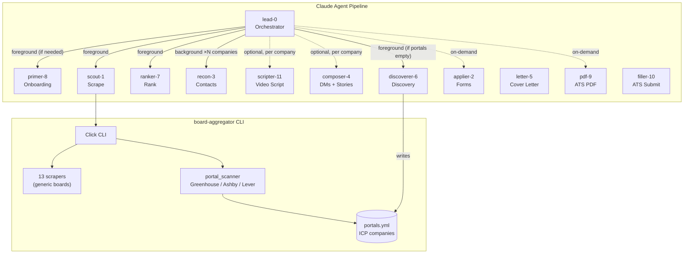

# dossier

Agent pipeline that scrapes 13 job boards plus your ICP companies' ATS portals (Greenhouse / Ashby / Lever), scores postings against your skills, finds hiring managers, and drafts personalized pitches. Anti-mass-apply.

## Quick Start

> **Requires the [Claude Code](https://code.claude.com) terminal CLI.** The pipeline is driven by the `lead-0` agent, which can only be launched as the primary agent from the CLI (`claude --agent lead-0`). It cannot be started from the Claude Desktop app or claude.ai/code — see [Claude Desktop & claude.ai](#claude-desktop--claudeai) below.

```bash
git clone https://github.com/0xQuinto/dossier.git
cd dossier
claude --agent lead-0
```

That's it. On first run, `lead-0` detects missing setup and walks you through everything:
- Installing prerequisites (Python 3.12+, git, Homebrew, Node.js 20+)
- Setting up the virtual environment and dependencies
- Installing Playwright + Chromium for CV PDF rendering
- Configuring Exa MCP for contact research
- Building your skills inventory and resume from your existing materials (CV, portfolio, GitHub, LinkedIn)

**Manual alternative:** `python setup_wizard.py` handles venv + deps + Exa MCP without the profile builder.

## Claude Desktop & claude.ai

**This pipeline runs only in the Claude Code terminal CLI.** Both the Desktop app and claude.ai/code load this repo's `.claude/` config (CLAUDE.md, settings, MCP servers, skills, and the agent files themselves), but **neither lets you launch a custom agent as the main thread** — there's no `--agent` equivalent or agent picker. Because `lead-0` orchestrates by spawning subagents (`scout-1`, `ranker-7`, …) and a custom agent can only be made the main thread via the CLI, the orchestrator can't be started on those surfaces. The same applies to the on-demand agents (`letter-5`, `pdf-9`, `applier-2`, `filler-10`) — they're custom agents too.

| Surface | Reads `.claude/` config | Launch `lead-0` / on-demand agents | Run the pipeline |
|---|:---:|:---:|:---:|
| **Terminal CLI** | ✅ | ✅ `claude --agent <name>` | ✅ |
| **Claude Desktop** (local) | ✅ | ❌ no agent launcher | ❌ — use the CLI |
| **claude.ai/code** (cloud) | ✅ (cloned in) | ❌ no agent launcher | ❌ — use the CLI |

- **Claude Desktop** is a full local Claude Code engine (runs bash, edits files, shares config with the CLI), but it has no UI to make `lead-0` the primary agent — run the pipeline from a terminal instead. The raw scraper (`board-aggregator`) still works in any shell.
- **claude.ai/code** cloud sessions can be started from the CLI with `claude --remote "<task>"` (push your commits first — it clones from GitHub), but `--remote` cannot be combined with `--agent`, so it can't drive `lead-0`. Cloud sessions are fine for other repo tasks, just not this pipeline.

Docs: [sub-agents (CLI-only)](https://code.claude.com/docs/en/sub-agents) · [Claude Code on the web](https://code.claude.com/docs/en/claude-code-on-the-web) · [Desktop](https://code.claude.com/docs/en/desktop)

## How the pipeline works

```
Phase 1 — Scrape       scout-1 runs board-aggregator CLI across 13 boards + ATS portal scan of your ICP companies
Phase 2 — Rank         ranker-7 scores each posting against your skills inventory
Phase 3 — Research     recon-3 finds hiring managers via Exa + Chrome (parallel per company)
Phase 4 — Pitch        (optional) scripter-11 drafts the video pitch, then composer-4 produces DM drafts + STAR+R stories — skipped by default, offered after the other phases finish
```

The pipeline orchestrator (`lead-0`) runs phases sequentially. Phase 3 spawns one subagent per company in parallel. **Phase 4 is optional** — skipped by default and offered once the other phases finish.

**Two scrape sources, one merged feed:**
- **Generic boards** — 13 public boards (Indeed, LinkedIn, RemoteOK, Himalayas, HN, crypto/web3 boards, …) — wide net, noisy.
- **Per-company ATS portals** — direct hits to Greenhouse / Ashby / Lever public APIs for the companies in `portals.yml` — narrow, high-signal. No auth needed. Scout-1 marks portals inactive after 30 days with no openings; `discoverer-6` adds new ones.

**Portal discovery:** If `portals.yml` is missing or has no active companies, `lead-0` offers to run `discoverer-6` to auto-discover companies matching your skills-inventory and populate it before Phase 1. You can also run `discoverer-6` standalone anytime to expand the list.

Each run writes to a timestamped directory under `research/runs/`. The most recent run is symlinked at `research/latest/`.

**On-demand agents (outside the pipeline):**
- `applier-2` — generates copy-paste answers for application forms (human-in-the-loop)
- `letter-5` — ATS cover letter generation (keyword injection + SOAR proof points)
- `pdf-9` — tailored ATS PDF CV generation (keyword injection + bullet reordering)
- `filler-10` — hybrid ATS submitter: API-first for Lever/Ashby, browser automation for Greenhouse/Workday/others (human-in-the-loop)

**Utilities:**
- `scripts/tracker.py` — application status tracker CLI (add, update, import-run, dedup, show)
- `dashboard/` — Go TUI for browsing applications (Bubble Tea + Lipgloss)
- `scripts/generate-pdf.mjs` — Playwright-based ATS PDF renderer

## Architecture



## Adding a scraper

1. Create `board_aggregator/scrapers/your_board.py`
2. Subclass `BaseScraper` and implement `scrape()`
3. Decorate with `@register`
4. Import in `board_aggregator/cli.py`
5. Add a test with a fixture in `tests/`

See `board_aggregator/scrapers/remoteok.py` for a minimal example.

## Development

```bash
git clone https://github.com/0xQuinto/dossier.git
cd dossier
python -m venv .venv
.venv/bin/pip install -e ".[dev]"
.venv/bin/pytest
```

## License

MIT — see [LICENSE](LICENSE).
