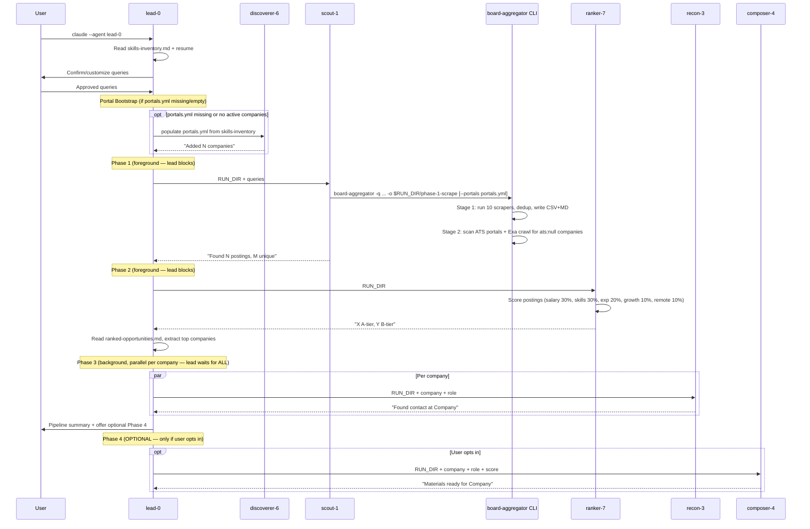

# Codebase Map

> Auto-generated by Cartographer. Last mapped: 2026-04-15

## System Overview

```mermaid
graph TB
    subgraph Pipeline["Claude Agent Pipeline"]
        Lead[lead-0<br/>Orchestrator]
        Scout[scout-1<br/>Phase 1: Scrape]
        Ranker[ranker-7<br/>Phase 2: Rank]
        Recon[recon-3<br/>Phase 3: Contacts]
        Composer[composer-4<br/>Phase 4: Pitch<br/>(optional)]
        Disc[discoverer-6<br/>Portal Bootstrap]
    end

    subgraph BoardAgg["board-aggregator CLI"]
        CLI[cli.py]
        Runner[runner.py]
        Registry[scrapers/__init__.py]
        Scrapers["13 scrapers<br/>(13 boards)"]
        Portal[portal_scanner.py]
        Output[output.py]
        Models[models.py]
    end

    subgraph External["External Services"]
        JobSpy[python-jobspy<br/>Indeed + LinkedIn]
        APIs["REST APIs<br/>Himalayas, RemoteOK"]
        RSS["RSS Feeds<br/>WWR, crypto.jobs"]
        HTML["HTML Scraping<br/>web3career, cryptocurrencyjobs"]
        NextJS["Next.js JSON<br/>CryptoJobsList"]
        Algolia["Algolia API<br/>HN Who's Hiring"]
        Reddit["Reddit JSON API<br/>20 subreddits"]
        ATS["ATS APIs<br/>Greenhouse / Ashby / Lever"]
        Exa[Exa MCP]
        Chrome[Claude-in-Chrome]
    end

    subgraph Data["Input Files"]
        Skills[skills-inventory.md]
        Resume[resume-*.md]
        Portals[portals.yml]
    end

    subgraph RunDir["research/runs/$RUN_ID/"]
        P1[phase-1-scrape/]
        P2[phase-2-rank/]
        P3[phase-3-contacts/]
        P4[phase-4-pitch/]
    end

    Lead -->|foreground| Scout
    Lead -->|foreground| Ranker
    Lead -->|"background ×N companies"| Recon
    Lead -.->|"optional, per company"| Composer
    Lead -.->|"if portals missing/empty"| Disc
    Disc -.->|populates| Portals

    Scout --> CLI
    CLI --> Runner
    Runner --> Registry
    Registry --> Scrapers
    Runner --> Portal
    Scrapers --> JobSpy
    Scrapers --> APIs
    Scrapers --> RSS
    Scrapers --> HTML
    Scrapers --> NextJS
    Scrapers --> Algolia
    Scrapers --> Reddit
    Portal --> ATS
    Runner --> Output

    Recon --> Exa
    Recon --> Chrome
    Scout -.->|optional Wellfound| Chrome
    Disc --> Exa

    Skills --> Ranker
    Skills --> Composer
    Resume --> Lead
    Resume --> Composer
    Portals --> Scout

    Scout --> P1
    Ranker --> P2
    Recon --> P3
    Composer --> P4
```

## Directory Structure

```
.
├── .claude/
│   ├── CLAUDE.md                  # Project instructions (survives context compaction)
│   ├── settings.json               # Committed baseline permissions (ships with repo)
│   ├── settings.local.json        # User-local permission overrides
│   └── agents/
│       ├── lead-0.md              # Pipeline orchestrator (Opus)
│       ├── scout-1.md             # Phase 1 scraper (Sonnet)
│       ├── ranker-7.md            # Phase 2 scorer (Sonnet)
│       ├── recon-3.md             # Phase 3 contact finder (Sonnet)
│       ├── composer-4.md          # Phase 4 pitch generator (Opus, optional)
│       ├── scripter-11.md         # Phase 4 video script generator (Opus, optional)
│       ├── discoverer-6.md        # Company discovery via Exa (Sonnet)
│       ├── primer-8.md            # Onboarding agent (Opus)
│       ├── applier-2.md           # Application form answer generator (Sonnet)
│       ├── letter-5.md            # ATS cover letter generation (Opus, on-demand)
│       ├── pdf-9.md               # ATS PDF CV generation (Sonnet)
│       └── filler-10.md           # Hybrid ATS submitter: API + browser (Opus, on-demand, human-in-the-loop)
├── .github/
│   └── workflows/
│       ├── test.yml               # CI: pytest on Python 3.12 + 3.13 (push/PR to main)
│       └── publish.yml            # CD: build + publish to PyPI on GitHub Release
├── board_aggregator/              # Python package — job board scraping engine
│   ├── __init__.py                # Package init, __version__ = "0.1.0"
│   ├── cli.py                     # Click CLI entrypoint (board-aggregator command)
│   ├── models.py                  # JobPosting Pydantic model + dedup_key
│   ├── output.py                  # CSV + Markdown writers
│   ├── runner.py                  # Two-stage orchestration: boards + portals, dedup, output
│   ├── portal_scanner.py          # ATS API clients (Greenhouse, Ashby, Lever) + YAML state
│   └── scrapers/
│       ├── __init__.py            # Registry: SCRAPER_REGISTRY, @register, get_all_scrapers()
│       ├── base.py                # BaseScraper ABC
│       ├── jobspy_boards.py       # python-jobspy: Indeed, LinkedIn
│       ├── himalayas.py           # Himalayas REST API (paginated)
│       ├── weworkremotely.py      # We Work Remotely (4 RSS feeds)
│       ├── hn_hiring.py           # HN Who's Hiring via Algolia API
│       ├── hn_freelancer.py       # HN Freelancer? Seeking freelancer? thread (subclasses HNHiringScraper)
│       ├── cryptojobslist.py      # CryptoJobsList via __NEXT_DATA__ JSON
│       ├── crypto_jobs.py         # crypto.jobs RSS + BS4 description parsing
│       ├── web3career.py          # web3.career HTML table parsing
│       ├── cryptocurrencyjobs.py  # cryptocurrencyjobs.co HTML card parsing
│       ├── remoteok.py            # RemoteOK JSON API
│       ├── reddit_jobs.py         # Reddit multireddit JSON API (20 subreddits, 2 tiers)
│       ├── indiehackers.py        # Indie Hackers public Algolia jobAds index (closedTimestamp filter)
│       └── nocodejobs.py          # No Code Jobs static Astro HTML (.job-item data-* attrs)
├── templates/
│   ├── skills-inventory.example.md  # Starter template copied to skills-inventory.md by wizard
│   ├── resume.example.md            # Starter template copied to resume.md by wizard
│   ├── cv-template.html             # ATS PDF HTML template (input to pdf-9)
│   ├── cover-letter-template.html   # ATS cover letter HTML template (input to letter-5)
│   └── states.yml                   # Application status definitions (input to tracker.py)
├── tests/
│   ├── conftest.py                # Shared fixtures (HIMALAYAS_API_RESPONSE constant)
│   ├── fixtures/                  # Real HTML/JSON/XML samples from live sites
│   ├── test_models.py             # JobPosting model + dedup_key
│   ├── test_output.py             # CSV/Markdown output
│   ├── test_runner.py             # Dedup logic + collect_from_boards
│   ├── test_jobspy_boards.py      # jobspy scraper
│   ├── test_himalayas.py          # Himalayas scraper
│   ├── test_weworkremotely.py     # WeWorkRemotely scraper
│   ├── test_crypto_jobs.py        # crypto.jobs scraper
│   ├── test_hn_hiring.py          # HN Who's Hiring scraper
│   ├── test_web3career.py         # web3.career scraper
│   ├── test_cryptocurrencyjobs.py # cryptocurrencyjobs scraper
│   ├── test_cryptojobslist.py     # CryptoJobsList scraper
│   ├── test_portal_scanner.py     # ATS portal scanner (lifecycle, Greenhouse, Ashby, Lever)
│   ├── test_reddit_jobs.py        # Reddit scraper (pagination, retry, company extraction)
│   ├── test_indiehackers.py       # Indie Hackers Algolia scraper
│   ├── test_nocodejobs.py         # No Code Jobs HTML scraper
│   ├── test_tracker.py            # Application tracker CLI (17 tests)
│   └── test_wizard.py             # setup_wizard.py helpers
├── docs/
│   └── CODEBASE_MAP.md            # This file
├── research/                      # Pipeline run outputs (gitignored)
│   ├── runs/                      # Timestamped run directories
│   └── latest -> runs/...         # Symlink to most recent run
├── dashboard/                     # Go TUI for application tracking (Bubble Tea + Lipgloss)
│   ├── main.go                    # Entry point: reads tracker + reports, launches TUI
│   ├── go.mod / go.sum            # Go module deps (bubbletea, lipgloss, glamour)
│   └── internal/
│       ├── data/parser.go         # Parses applications.md + phase-2 ranked-opportunities.md
│       └── ui/                    # model.go (Bubble Tea model), views.go (tab rendering), theme.go
├── scripts/
│   ├── tracker.py                 # Application tracker CLI: add, update, import-run, dedup, show
│   ├── generate-pdf.mjs           # Playwright-based ATS PDF renderer (HTML → PDF)
│   └── normalize-ats.mjs          # Text normalization helpers for ATS parsing
├── negotiation-playbook.md        # Salary negotiation scenario templates (input to applier-2, composer-4)
├── LICENSE                        # MIT
├── README.md                      # Quickstart + architecture overview
├── portals.yml                    # Target company registry for ATS scanning (gitignored, runtime-generated)
├── skills-inventory.md            # User's skills inventory (gitignored, generated by wizard)
├── setup_wizard.py                # First-time setup script (stdlib only)
├── package.json                   # Node deps (Playwright for PDF generation)
└── pyproject.toml                 # board-aggregator 0.1.0, Python >=3.12
```

## Module Guide

### board_aggregator/cli.py

**Purpose:** Click CLI entry-point; parses args and delegates entirely to `runner.run_all()`.
**Entry point:** `main()` (registered as `board-aggregator` script in pyproject.toml)
**Options:**
| Flag | Default | Description |
|------|---------|-------------|
| `-q/--query` (multiple) | 7 built-in queries | Search queries |
| `-o/--output-dir` | `research/phase-1-scrape` | Output directory |
| `-s/--scraper` (multiple) | all | Filter to specific scrapers by name |
| `-p/--portals` | None | Path to portals.yml for ATS scanning |
| `--remote-only/--include-onsite` | remote-only | Job location filter |
| `--list-scrapers` | — | Print registry keys and exit |

**Critical gotcha:** All 10 scraper modules are imported **inside** `main()` (not at module top-level). This is intentional — it triggers `@register` only on CLI invocation. Forget to add an import here and the scraper silently never runs.

---

### board_aggregator/runner.py

**Purpose:** Two-stage orchestrator: board scrapers → portal scanner → dedup → file output.
**Exports:** `run_all()`, `collect_from_boards()`, `deduplicate()`, `_richness()`

**Data flow:**
1. `collect_from_boards()` — iterates `get_all_scrapers()`, calls `scraper.scrape()`, swallows per-scraper exceptions with a `print()`.
2. If `portals_path` provided — calls `portal_scanner.scan_portals()` (which also rewrites `portals.yml`), then reads `portals.yml` again to get `title_filter`, calls `filter_by_title()`.
3. Dedup + write CSV + Markdown.

**Dedup key:** `(title.lower(), company.lower())`. On collision, keeps the posting with higher richness: `salary_min` (+3), `salary_max` (+3), `description` (+2), `date_posted` (+1), `job_type` (+1).

**Gotcha:** `portals.yml` is read twice — once inside `scan_portals()` (which also writes it back) and once again by `run_all()` to read `title_filter`. The second read sees the already-updated file.

---

### board_aggregator/portal_scanner.py

**Purpose:** Fetches job listings from ATS platform public APIs; manages scan-state in `portals.yml`.
**Exports:** `fetch_greenhouse()`, `fetch_ashby()`, `fetch_lever()`, `filter_by_title()`, `scan_portals()`

**ATS endpoints (all unauthenticated):**
| ATS | Endpoint |
|-----|---------|
| Greenhouse | `GET https://boards-api.greenhouse.io/v1/boards/{slug}/jobs` |
| Ashby | `GET https://api.ashbyhq.com/posting-api/job-board/{slug}?includeCompensation=true` |
| Lever | `GET https://api.lever.co/v0/postings/{slug}?mode=json` |

**Salary extraction:** Ashby reads `compensationTiers[0].components[]` (filter `compensationType == "Salary"`). Lever reads top-level `salaryRange`. Greenhouse has no salary data.

**`filter_by_title()`:** Requires ≥1 positive keyword match AND zero negative keyword matches (case-insensitive substring). Keywords come from `portals.yml` → `title_filter`.

**`scan_portals()` skip conditions:** `active: False`, `ats: None`, no `slug`, or `last_scanned` within `scan_interval_days` (default 7). Auto-disables companies with no openings for `disable_after_days` (default 30) days.

**Gotchas:**
- `scan_portals()` rewrites the entire YAML file via `yaml.dump()`. YAML comments in `portals.yml` are **destroyed on first write**.
- Greenhouse `is_remote` detection depends on a `metadata` field named `"Location Type"` — companies that don't configure this metadata always yield `is_remote=False`.
- `_strip_html()` uses a simple regex, not a parser — malformed HTML may leave artifacts.

---

### board_aggregator/models.py

**Purpose:** Single canonical data model shared across all scrapers and output writers.
**Exports:** `JobPosting` (Pydantic BaseModel)

**Required fields:** `title`, `company`, `source`, `job_url`
**Optional fields:** `location`, `is_remote` (default `True`), `salary_min/max/currency/interval`, `date_posted`, `job_type`, `description`

**`dedup_key` property:** Returns `(title.lower(), company.lower())`. Does not normalize punctuation or Unicode.
**Field validators:** `title` and `company` are stripped of leading/trailing whitespace before storage.

---

### board_aggregator/output.py

**Purpose:** Writes deduplicated `JobPosting` lists to CSV and Markdown.
**Exports:** `write_csv()`, `write_markdown()`, `CSV_FIELDS`

**Markdown:** Includes per-source count breakdown (Counter), salary formatted as `$120,000 - $180,000 USD (yearly)`, description truncated to **300 chars**.

**Gotcha:** `path.write_text()` uses platform default encoding — could break on non-UTF-8 systems with exotic characters from crypto boards.

---

### board_aggregator/scrapers/

**Purpose:** 10 scraper classes covering 11 job boards via registry pattern.
**Pattern:** `@register` auto-inserts a class into `SCRAPER_REGISTRY` under its `name`. All scrapers must be imported in `cli.py` to trigger registration.

| Scraper | Board(s) | Method | Uses queries? | Notes |
|---------|----------|--------|---------------|-------|
| `jobspy` | Indeed, LinkedIn | python-jobspy library | **Yes** | 50 results/query, 1-week window; description truncated to 500 chars |
| `himalayas` | Himalayas | REST API (paginated) | No | Up to 5 pages × 20 jobs; Unix timestamp → ISO date |
| `weworkremotely` | We Work Remotely | 4 RSS feeds | No | Feeds: all-remote, mgmt/finance, full-stack, devops; title split on first `: ` |
| `hn_hiring` | HN Who's Hiring | Algolia API + comment parse | No | Latest "Who is Hiring?" thread; top-level comments only; salary via `$160K-$200K` regex; retry with backoff |
| `cryptojobslist` | CryptoJobsList | `__NEXT_DATA__` JSON extraction | No | 4 category pages; salary from nested object `minValue/maxValue` |
| `crypto_jobs` | crypto.jobs | RSS + BeautifulSoup | No | Structured `<p><strong>Key:</strong> Value</p>` fields; prefers `<guid>` over `<link>` |
| `web3career` | web3.career | HTML table parsing | No | 4 category pages; rows selected by `tr[onclick]`; location from `tds[3]` only |
| `cryptocurrencyjobs` | cryptocurrencyjobs.co | HTML card parsing | No | 3 category pages; `<li>` cards; multi-currency salary regex |
| `remoteok` | RemoteOK | JSON API | No | Skips first array element (legal notice); `is_remote=True` hardcoded |
| `reddit` | 19 subreddits (multireddit) | Reddit JSON API (`/new.json`) | No | 2-tier system; Tier 2 needs hiring-signal regex; 5-step company extraction; 3-page limit; retry on 429 |

**Reddit scraper tiers:**
- **Tier 1** (direct job boards): `forhire`, `hiring`, `jobbit`, `remotejobs` — posts pass without keyword filtering
- **Tier 2** (adjacent communities): 15 subreddits — posts must match hiring signal regex: `\b(hiring|we.re hiring|job opening|open position|apply now|apply here|apply at)\b`

---

## Agent Definitions (.claude/agents/)

| Agent | Phase / Role | Model | Key Tools | Blocking? |
|-------|-------------|-------|-----------|-----------|
| `lead-0` | Orchestrator | Opus | Agent spawning, Read, Write, Glob, Grep | Main thread |
| `scout-1` | Phase 1 — Scrape | Sonnet | Bash (CLI), Read, Write, WebFetch, Exa crawl, Chrome | Foreground |
| `ranker-7` | Phase 2 — Rank | Sonnet | Read, Write, Grep, Glob | Foreground |
| `recon-3` | Phase 3 — Contacts | Sonnet | Read, Write, WebSearch, Exa advanced search, Chrome | Background (one per company) |
| `scripter-11` | Phase 4 (optional) — Video scripts | Opus | Read, Write, Glob | Foreground, sequential per company; skipped by default, offered after summary |
| `composer-4` | Phase 4 (optional) — Pitch materials | Opus | Read, Write, Glob | Foreground, sequential per company; skipped by default, offered after summary |
| `discoverer-6` | Portal discovery | Sonnet | Read, Write, Exa company research, WebFetch | Auto-dispatched by lead-0 (foreground) when portals.yml is missing/empty; also runs standalone |
| `primer-8` | Onboarding | Opus | Read, Write, Edit, Glob, Grep, Bash, WebFetch, WebSearch | Spawned by lead-0 on readiness check failure |
| `applier-2` | Application forms | Sonnet | Read, Write, Glob, Grep | On-demand, human-in-the-loop |
| `letter-5` | ATS cover letter | Opus | Read, Write, Glob, Grep | On-demand, keyword injection + SOAR proof points |
| `pdf-9` | ATS PDF generation | Sonnet | Read, Write, Glob, Grep, Bash | On-demand; self-renders PDF via `node scripts/generate-pdf.mjs`; keyword injection + bullet reordering; enforces Work-Experience-vs-Projects section boundaries |
| `filler-10` | ATS submitter | Opus | Read, Write, Glob, Grep, Bash, Chrome MCP | On-demand, hybrid (API + browser), human-in-the-loop |

**`discoverer-6` role:** Populates `portals.yml` with companies matching the user's ICP. lead-0's Portal Bootstrap step auto-dispatches it (foreground) when `portals.yml` is missing or has no `active: true` companies; it also runs standalone. If `portals.yml` is missing it first scaffolds one (`config` + `title_filter` from `templates/portals.example.yml`, empty `companies`). Searches Exa by vertical, detects ATS platform from careers URL patterns, scores ICP fit 1-10, appends entries scoring ≥ `config.icp_min_score`. Never modifies `last_scanned`, `last_had_openings`, or `active` — those are scout-1's fields.

**`primer-8` role:** Onboarding agent spawned by lead-0 when readiness check fails. Handles prerequisites (Homebrew, Python 3.12+, git), Exa MCP configuration, project permissions, and profile building (skills-inventory.md + resume.md). Guides user through setup steps and validates the installation before returning control to lead-0.

---

### portals.yml Structure

```yaml
config:
  scan_interval_days: 7        # skip company if last_scanned within this many days
  disable_after_days: 30       # auto-disable if no openings for this long
  max_discovery_calls: 10      # Exa API budget for discoverer-6
  icp_min_score: 6             # minimum fit score for discoverer-6 to add a company

title_filter:
  positive: [...]              # job title must contain ≥1 of these (case-insensitive)
  negative: [...]              # job title must not contain any of these

companies:
  - name: Acme Corp
    domain: acme.com
    ats: greenhouse            # "greenhouse" | "ashby" | "lever" | null
    slug: acmecorp             # ATS-specific slug; null when ats is null
    careers_url: ...           # used by scout-1 Exa crawl when ats is null
    icp_fit_score: 8
    icp_fit_reasoning: "..."
    source: exa-discovery      # "manual" | "exa-discovery"
    discovered_at: 2026-04-01
    last_scanned: null         # updated by scan_portals() after each scan
    last_had_openings: null    # updated by scan_portals() when roles found
    active: true
```

---

## Data Flow



**Phase 4 is optional and runs last.** It is skipped by default; lead-0 offers it to the user after the pipeline summary. When the user opts in, scripter-11 → composer-4 run foreground, sequentially per company. Phase 3 (contacts) is the only background phase — one subagent per company in parallel.

---

## Test Suite

**97 tests** across 15 test files. Run with: `.venv/bin/pytest`

### Test Strategy

Three mocking patterns used throughout:

1. **`responses` library** — HTTP interception for scrapers making direct HTTP calls. `@responses.activate` + `responses.add(...)` registers fake responses; no real network traffic.
2. **`feedparser` pre-parse** — For RSS scrapers: real `feedparser.parse()` is called at module import time on an inline RSS string (so real parsing is tested), then `feedparser.parse` inside the scraper is mocked to return that pre-parsed result.
3. **`unittest.mock.patch`** — For scrapers delegating to third-party libraries (`jobspy.scrape_jobs`). Returns a Pandas DataFrame or pre-parsed object.

`tmp_path` (built-in pytest fixture) is used in `test_portal_scanner.py` and `test_wizard.py` for ephemeral YAML/env files.

### Test File Summary

| File | What it tests | Tests | Mocking |
|------|--------------|-------|---------|
| `test_models.py` | `JobPosting` fields, defaults, `dedup_key` | 6 | None |
| `test_output.py` | `write_csv`, `write_markdown` | 2 | Real FS via tempfile |
| `test_runner.py` | `deduplicate`, `collect_from_boards` | 4 | MagicMock + patch |
| `test_jobspy_boards.py` | JobSpy wrapper | 2 | patch `scrape_jobs` |
| `test_himalayas.py` | JSON parsing, salary, timestamp, 429 | 4 | `responses` |
| `test_weworkremotely.py` | RSS parse, company/title split, empty feed | 3 | feedparser pre-parse |
| `test_crypto_jobs.py` | Company from HTML, guid vs link, title strip | 4 | feedparser pre-parse |
| `test_hn_hiring.py` | Top-level filter, salary, no-thread edge case | 3 | `responses` |
| `test_web3career.py` | HTML rows, onclick URL, salary, remote | 4 | `responses` + HTML fixture |
| `test_cryptocurrencyjobs.py` | li cards, salary, company-without-link | 4 | `responses` + HTML fixture |
| `test_cryptojobslist.py` | `__NEXT_DATA__` extraction, null salary | 3 | `responses` + inline HTML |
| `test_portal_scanner.py` | Greenhouse/Ashby/Lever, lifecycle, `run_all` integration | 20 | `responses` + JSON fixtures + `tmp_path` |
| `test_reddit_jobs.py` | Pagination, 429 retry, 5 company extraction patterns | 9 | `responses` with URL regex |
| `test_tracker.py` | Application tracker CLI: add, update, import-run, dedup, show | 17 | `tmp_path` + inline Markdown |
| `test_wizard.py` | Version check, command detection, template copy, env write, validate_install | 9 | patch `sys.version_info` + `tmp_path` |

### Fixture Files (tests/fixtures/)

| File | Type | Provides |
|------|------|---------|
| `greenhouse_anthropic.json` | JSON | 2 Greenhouse jobs: one office (Location Type null), one remote |
| `ashby_ramp.json` | JSON | 2 Ashby jobs: one listed (AI Ops, salary tiers), one unlisted (skipped) |
| `lever_example.json` | JSON | 2 Lever jobs: one with salaryRange, one null |
| `cryptocurrencyjobs_html.html` | HTML | 4 job cards (salary-present, salary-absent, company-without-link) |
| `web3career_jobs_html.html` | HTML | 4 job table rows (remote/Warsaw, salary, onclick URL) |
| `himalayas_api_response.json` | JSON | Reference sample (tests use conftest.py constant) |
| `hn_algolia_response.json` | JSON | Reference sample (tests use inline dicts) |
| `cryptojobs_rss_sample.xml` | XML | Reference sample (tests use inline RSS string) |
| `wwr_rss_sample.xml` | XML | Reference sample (tests use inline RSS string) |
| `cryptojobslist_next_data_jobs.json` | JSON | Reference sample (tests use inline HTML) |
| `*_field_mapping.md` (7 files) | Markdown | Developer reference docs; not loaded by tests |

---

## Setup and Distribution

### setup_wizard.py (stdlib only)

Onboarding script; runs **before** the venv exists.

| Step | Function | What it does |
|------|---------|-------------|
| 1 | `check_prerequisites()` | Asserts Python ≥3.12; warns if `claude` CLI missing; exits if `git` missing |
| 2 | `setup_venv()` | Creates `.venv/`; installs `.[dev]` silently via pip |
| 3 | `setup_templates()` | Copies `templates/skills-inventory.example.md` → `skills-inventory.md` and `templates/resume.example.md` → `resume.md` if not already present; opens in `$EDITOR` if set |
| 4 | `setup_exa_mcp()` | Prompts for Exa API key; configures the Exa MCP via `claude mcp add --transport http exa <url>`; skips if already configured |
| 5 | `validate_install()` | Imports `board_aggregator.__version__` via subprocess; runs `--list-scrapers` and counts output lines |

Copy functions are **idempotent** — skips if destination exists. Re-running the wizard is safe.

### GitHub Workflows

**test.yml** — Triggers on push/PR to `main`. Matrix: Python 3.12 and 3.13 on `ubuntu-latest`. Installs `.[dev]`, runs `pytest -v`. No coverage upload.

**publish.yml** — Triggers on GitHub Release (type: `published`). Builds with `python -m build`; publishes via `pypa/gh-action-pypi-publish` using OIDC trusted publishing (no PyPI token secret needed — configure the trusted publisher on PyPI and enable the `pypi` environment in repo settings).

---

## Conventions

- **Agent naming:** Non-descriptive aliases (lead-0, scout-1, etc.) prevent Claude from inferring default behaviors from names
- **Subagent output contract:** Verbose data goes to files; subagents return only 1-2 sentence summaries to lead-0. This survives context compaction because it's in CLAUDE.md.
- **Run versioning:** All output under `research/runs/$RUN_ID/`; `RUN_DIR` is passed dynamically to every subagent by lead-0. Never hardcode it in agent definitions.
- **Registry pattern:** Scrapers self-register via `@register`; must be explicitly imported in `cli.py:main()` to trigger registration.
- **Dedup key:** `(title.lower(), company.lower())` — richer version wins on collision.
- **Test strategy:** `responses` library for HTTP mocks; feedparser pre-parse trick for RSS; `unittest.mock.patch` for library wrappers. Real HTML/JSON fixtures for scrapers with complex parsing.
- **Portal state ownership:** `last_scanned`, `last_had_openings`, `active` are owned by `scan_portals()` (scout-1). `discoverer-6` only appends new entries; never mutates existing ones.

---

## Gotchas

- **Scraper registration is import-dependent.** Adding a scraper file without importing it in `cli.py:main()` silently excludes it from all runs.
- **Most scrapers ignore queries.** Only `jobspy` uses the query list for filtered search. All other scrapers return their full board listing regardless of the query passed.
- **`portals.yml` comments are destroyed on first scan.** `scan_portals()` uses `yaml.dump()` which strips all YAML comments. Keep a separate reference copy if comments matter.
- **`is_remote` defaults to True.** Scrapers that can't detect remote status inflate remote counts.
- **Greenhouse has no salary data.** The `/v1/boards/{slug}/jobs` endpoint does not return compensation.
- **Greenhouse `is_remote` requires custom metadata.** Detection depends on a metadata field named `"Location Type"` — companies that don't configure this always yield `is_remote=False`.
- **HTML scrapers are fragile.** `web3career`, `cryptocurrencyjobs`, and `cryptojobslist` parse specific DOM structures that can break without notice.
- **CLI default output path is non-versioned.** CLI defaults to `research/phase-1-scrape`; the pipeline always overrides with `-o $RUN_DIR/phase-1-scrape`.
- **Reddit links point to threads, not company sites.** `job_url` is a Reddit permalink, not a company ATS link. Leads require manual follow-up.
- **`settings.local.json` has a dead `mcp__jobspy__*` entry.** Legacy from when jobspy was an MCP server. Current design runs it as a subprocess via the CLI.
- **Phase 4 is optional and deferred.** It is skipped by default and offered after the pipeline summary; only Phase 3 runs in the background. When opted into, Phase 4 runs foreground, sequentially per company — never simultaneously with Phase 3.
- **Markdown description truncated twice.** Scrapers truncate to 500 chars; `output.py` truncates again to 300 chars.
- **`pdf-9` requires Node.js ≥20 + Playwright.** It self-renders the PDF by shelling out to `node scripts/generate-pdf.mjs`. The dependency is enforced by `lead-0`'s readiness check, not by `setup_wizard.py`.
- **`pdf-9` enforces section boundaries.** Work Experience and Projects must never cross-contaminate (e.g., side projects must not appear under Work Experience). Non-obvious constraint embedded in the agent definition.
- **Exa is configured via MCP, not `.env`.** `setup_exa_mcp()` runs `claude mcp add --transport http exa <url>`. Any docs describing a `.env`-based Exa key workflow are stale.

---

## Navigation Guide

**To add a new scraper:**
1. Create `board_aggregator/scrapers/new_board.py`, subclass `BaseScraper`, implement `scrape()`, add `@register`
2. Import it inside `cli.py:main()` (after the existing 10 imports)
3. Add a test in `tests/test_new_board.py` following the patterns in `test_himalayas.py` (JSON API) or `test_web3career.py` (HTML scraper)
4. Add a fixture in `tests/fixtures/` if the scraper has complex HTML/JSON parsing

**To add a new ATS platform to portal_scanner:**
1. Add `fetch_newats()` to `portal_scanner.py`
2. Add a branch to `scan_portals()` in the ATS dispatch block
3. Add test fixtures and tests in `test_portal_scanner.py`

**To change scoring weights:** Edit `.claude/agents/ranker-7.md` scoring rubric table.

**To modify pitch format:** Edit `.claude/agents/composer-4.md` output format section.

**To discover new target companies:** Run `claude --agent discoverer-6` independently before the pipeline.

**To run the full pipeline:** `claude --agent lead-0`

**To run just the scraper CLI:** `.venv/bin/board-aggregator -q "query" -o output_dir`

**To run just the scraper CLI with ATS portal scanning:** `.venv/bin/board-aggregator -q "query" -o output_dir --portals portals.yml`

**To run tests:** `.venv/bin/pytest`

---

If cartographer helped you, consider starring: https://github.com/kingbootoshi/cartographer - please!

## Recent Changes (cartographer update 2026-04-15)

Since 2026-04-08:

- **Repo renamed** `agent-job-research` → `dossier` (GitHub URLs, package.json, pyproject.toml, Go module path, all docs)
- **`HireBoost` legacy alias removed** from pyproject.toml description and `board_aggregator/cli.py`
- **`letter-5`** added — ATS cover letter generation (Opus, on-demand)
- **`filler-10`** added — hybrid ATS submitter (Lever/Ashby API + Greenhouse/Workday browser automation, human-in-the-loop)
- **`pdf-9`** switched from delegating to user → self-rendering PDF via `node scripts/generate-pdf.mjs`; added section-boundary rules
- **`lead-0` readiness check** now validates Node.js ≥20 + Playwright (required for `pdf-9`)

## Recent Changes (auto-synced 2026-04-30)

**37 files changed** since last sync.

- **config**: 1 files (pyproject.toml)
- **context_files**: 2 files (CLAUDE.md, CODEBASE_MAP.md)
- **docs**: 26 files (CLAUDE.md, composer-4.md, lead-0.md, pdf-9.md, primer-8.md...)
- **source**: 1 files (cli.py)
- **tests**: 13 files (README.md, expected-patterns.md, ranked-opportunities.md, company-context.md, contacts.md...)
